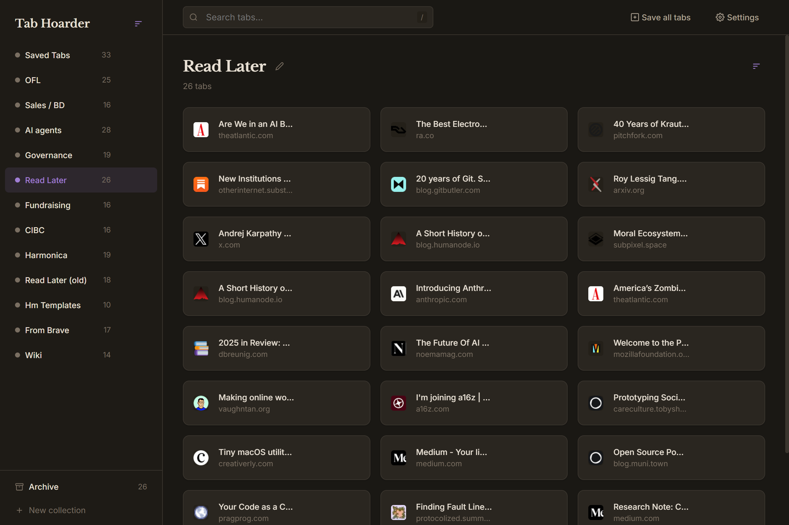

# Tab Hoarder

Chrome/Brave extension for managing browser tabs locally. Like [Toby](https://www.gettoby.com/), but open-source and self-hosted.



## Why Tab Hoarder?

Your tabs are yours. No accounts, no cloud sync, no tracking — everything stays in your browser's IndexedDB. If you've ever wanted a tab manager that respects your privacy and doesn't phone home, this is it.

## Features

**Core**
- Save and organize tabs into named collections
- Replaces new tab page with your tab manager
- Archive tabs instead of deleting them
- Drag and drop tabs between collections, reorder collections
- Move tabs between collections via dropdown menu
- Sort collections and tabs (manual, name, updated/created)
- Inline rename collections from sidebar or main title

**Quick save**
- **Toolbar icon click** — save current tab and close it
- **Alt+S** — save to most recent collection and close
- **Save all tabs** — creates a date-named collection from all window tabs
- Configurable save targets in Settings

**Search**
- Press `/` to search across all saved tabs

**Import & Export**
- Import from Toby export (JSON)
- Import Chrome bookmark folders as collections (with duplicate URL detection)
- Export all collections or just the current one as JSON
- Smart import deduplication — matches collections by name, skips duplicate URLs

**Backups**
- Automatic file backup to `Downloads/TabHoarder/` (browser-specific filenames)
- Configurable frequency (12h, daily, 3 days, weekly)
- chrome.storage.local backup — survives browser data clearing, restores transparently

**Customization**
- Light and dark theme toggle
- 6 accent color palettes (terracotta, ocean, forest, plum, slate, amber)
- Settings panel — gear icon in toolbar

**Extras**
- [Navidrome Jam](https://github.com/zhiganov/navidrome-jam) live room widget

## Keyboard Shortcuts

| Shortcut | Action |
|----------|--------|
| `Alt+S` | Save current tab to collection and close it |
| `/` | Focus search |

Set `Alt+S` at `chrome://extensions/shortcuts` if it wasn't auto-assigned.

## Install

```bash
npm install
npm run build
```

1. Open `chrome://extensions` (or `brave://extensions`)
2. Enable **Developer mode**
3. Click **Load unpacked** and select the `dist/` folder
4. Open a new tab — Tab Hoarder is your new tab page

## Development

```bash
npm run dev     # Vite dev server with HMR
npm run build   # Production build → dist/
```

After building, reload the extension in `chrome://extensions`.

## Stack

- **Preact** + Signals (~6kB) — UI framework
- **idb** — IndexedDB wrapper
- **Vite** — build tool
- **Custom CSS** — warm parchment/terracotta design, dark mode

## Changelog

See [CHANGELOG.md](CHANGELOG.md) for version history.

## License

MIT
